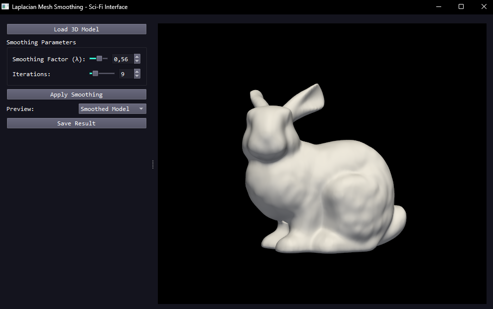

Артём, вот тебе ясный и структурированный **README.md**, чтобы любой понял, что это за проект, как его запустить и использовать.

---

````markdown
# 🛰️ Laplacian Mesh Smoothing — Sci-Fi UI

Интерактивное приложение на **Python + PyQt5 + PyVista** для сглаживания 3D-сеток методом **Laplacian smoothing**.  
Позволяет загрузить модель, настроить силу сглаживания и количество итераций, посмотреть результат "до/после" и сохранить его.

---

## 🚀 Возможности

- Загрузка моделей в формате **OBJ**.
- Настройка:
  - **Smoothing Factor (λ)** — от 0 до 1.
  - **Iterations** — от 1 до 50.
- Просмотр модели в 3D с вращением, масштабированием и перемещением (мышь).
- Переключение между исходной и сглаженной моделью (Preview).
- Сохранение сглаженной модели в OBJ.
- Темная **sci-fi** тема интерфейса.
- Автоматическая фиксация граничных вершин (грани не "съезжают").

---

## 📦 Установка

1. **Склонируй или скачай** проект:
   ```bash
   git clone https://github.com/username/laplacian-smoothing-sci-fi.git
   cd laplacian-smoothing-sci-fi
````

2. **Создай виртуальное окружение** (рекомендуется):

   ```bash
   python -m venv venv
   venv\Scripts\activate      # Windows
   source venv/bin/activate   # Linux/Mac
   ```

3. **Установи зависимости**:

   ```bash
   pip install -r requirements.txt
   ```

   Если файла `requirements.txt` нет, установи пакеты вручную:

   ```bash
   pip install PyQt5 pyvista pyvistaqt numpy
   ```

---

## ▶ Запуск

```bash
python main.py
```

После запуска появится окно приложения.

---

## 🖱 Управление

### 3D-виджет (правая панель)

* **ЛКМ** — вращение модели.
* **ПКМ / Shift + ЛКМ** — перемещение (панорамирование).
* **Колесо мыши** — масштабирование.
* **Двойной клик** — фокус камеры на модели.

### Интерфейс (левая панель)

1. **Load 3D Model** — выбор OBJ-файла.
2. **Smoothing Factor (λ)** — сила сглаживания:

   * 0.00 — без изменений.
   * 1.00 — вершины полностью тянутся к среднему соседей.
3. **Iterations** — количество итераций сглаживания.
4. **Apply Smoothing** — применить сглаживание.
5. **Preview** — переключатель "Original / Smoothed".
6. **Save Result** — сохранить сглаженную модель в OBJ.

---

## 📜 Как работает алгоритм

Используется **явная схема Laplacian smoothing**:

$$
v_i^{(t+1)} = v_i^{(t)} + \lambda \left( \frac{1}{|N(i)|} \sum_{j \in N(i)} v_j^{(t)} - v_i^{(t)} \right)
$$

* $v_i$ — позиция вершины.
* $N(i)$ — соседи вершины по рёбрам.
* λ — коэффициент сглаживания (0–1).
* Итерации повторяются указанное число раз.
* **Граничные вершины** фиксированы и не двигаются.

---

## 📂 Структура проекта

```
.
├── main.py           # Код приложения
├── requirements.txt  # Список зависимостей (опционально)
└── README.md         # Этот файл
```

---

## ⚠ Известные ограничения

* Поддерживаются только **треугольные/многоугольные поверхности** (PolyData).
* Возможна **усадка модели** при большом λ и числе итераций.
* Пока реализован только **explicit** метод. Неявный (implicit) — в планах.

---

## 💡 Планы по улучшению

* [ ] Добавить **Taubin smoothing** (анти-усадка).
* [ ] Реализовать **implicit Laplacian smoothing** (устойчивость при больших λ).
* [ ] Поддержка форматов STL, PLY, OFF.
* [ ] Side-by-side сравнение моделей.
* [ ] Многопоточность для больших моделей.

---

## 📝 Лицензия

MIT — можно использовать, модифицировать и распространять.

---

## 📷 Скриншот


## 📷 Пример работы

**До сглаживания:**


**После сглаживания (λ = 0.56, 9 итераций):**




